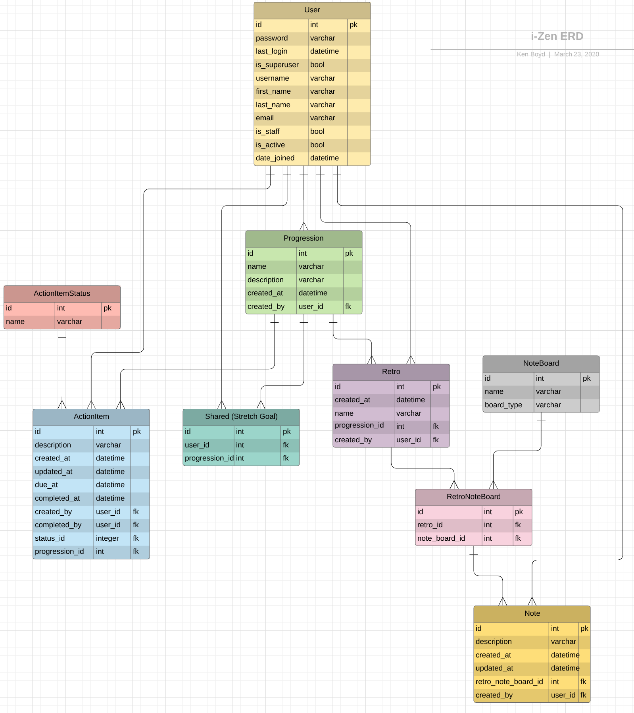

# iZen API

iZen is your personal retrospective board to help you continuously improve your hobbies and skills. Users can create a progression board for areas they want to grow and set up retros for self-evaluating their recent progress (or lack of progress). They can add notes stating what did or did not go well and set up completable action items to improve their development.

# Technologies Used

iZen's server side was developed in Python using [Django](https://www.djangoproject.com/) and [Django REST Framework](https://www.django-rest-framework.org/).

# Instructions for Installing the iZen API

1. Clone this repo

```sh
git clone git@github.com:klb417/i-Zen-api.git
```

2. cd into project

```sh
cd i-Zen-api
```

3. Create your virtual environment

- Windows:

```sh
python -m venv iZenEnv
source ./iZenEnv/Scripts/activate
```

- OSX:

```sh
python -m venv iZenEnv
source ./iZenEnv/bin/activate
```

4. Install the dependencies

```sh
pip install -r requirements.txt
```

5. Create the database

```sh
python manage.py makemigrations iZenEnv
python manage.py migrate
```

6. Load necessary fixtures

```sh
python manage.py loaddata actionitemstatus
python manage.py loaddata noteboard
```

7. Start the server

Testing iZen on emulator/simulator:

```sh
python manage.py runserver
```

Testing iZen on an Android or iOS device:

```sh
python manage.py runserver 0.0.0.0:8000
```

8. Start the [iZen client app](https://github.com/klb417/i-Zen-client)

# ERD


